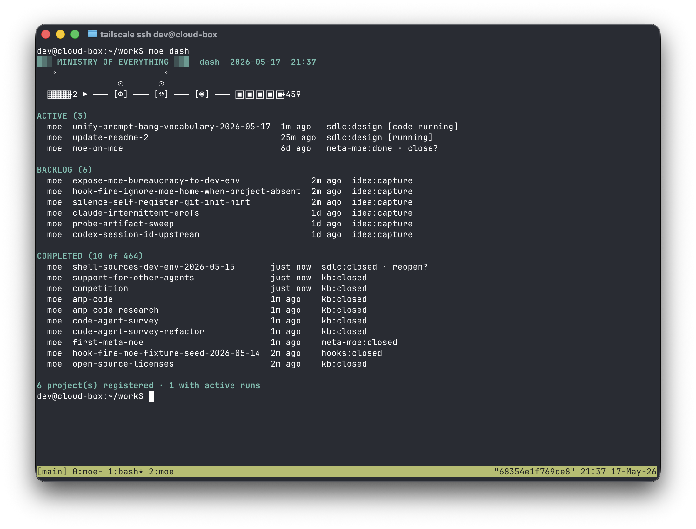

# ▓▒░ MINISTRY OF EVERYTHING ░▒▓

*An anti-social agent harness — one operator, a gaggle of bots.*

Ministry of Everything (MoE) helps one operator turn intent into parallel
agent work without losing context or control. Agents work in bounded threads
attached to markdown documents; every conversation, decision, and artifact
is saved back into a Git journal so the project keeps an improving memory of
itself.

The goal is not autonomous magic. The human remains the strategist,
scheduler, reviewer, and source of judgment. MoE removes the
coordination tax between thought and execution: backlog, runs,
followups, knowledge base, and digital twin all feed each other so the
operator and the bots share a compounding model of the project.

MoE runs [Claude Code](https://claude.com/claude-code) or
[Codex](https://chatgpt.com/codex/) against living markdown documents.
The document is the compact handoff between stages; the conversation
that produced it is saved underneath but rarely needs to be re-read.
Software development is the first workflow, with knowledge-base,
hook-authoring, meta-review, and digital-twin workflows alongside.

There is no background worker, no TUI, no dashboard that updates on its
own. Agents act only when you invoke a command. The UX problem is
**prioritization, supervision, and resumption**, not real-time updates.



## At a glance

MoE is a small CLI wrapped around a durable operating journal:

- **`moe/`** (this repo) — the Go CLI. Stdlib only, shells out to
  `git` and `claude`.
- **`bureaucracy/`** — the operator's personal journal: projects,
  runs, documents, backlog, digital twins, and the markdown fragments
  that steer agents. Discovered via a `bureaucracy.conf` marker file
  found by walking up from `$PWD`, or via `$MOE_HOME`.

Every turn lands as one commit on the bureaucracy's `main` branch, with
trailers (`MoE-Run`, `MoE-Document`, `MoE-Session`, …) that scope the
journal. Rewinding is `git reset --soft`; reverting is `git revert`.
Git is the checkpoint.

The feedback loop is the product:

- Ideas become backlog items without forcing a run.
- Runs turn backlog into designed, coded, tested, and shipped work.
- Agent-discovered loose ends harvest back into followups.
- Knowledge-base and twin workflows fold completed work into durable
  project memory.
- Future humans and agents start with better context than the last run
  had.

## Install

Requires Go 1.26+ and [Claude Code](https://claude.com/claude-code) on
your `PATH`.

```sh
go install github.com/modulecollective/moe/cmd/moe@latest
```

Scaffold a bureaucracy:

```sh
mkdir my-bureaucracy && cd my-bureaucracy
moe init
```

Register a target project (a git repo — the "thing being worked on"):

```sh
moe project add <repo-url>
```

Pick a default agent backend if you want one (optional — defaults to
`claude`; set `MOE_AGENT` in your shell rc, or pass `--agent codex` on
`moe sdlc new` for a single run):

```sh
export MOE_AGENT=codex
```

`moe help` is the source of truth for the command surface.

### Codex setup

If you'll use the `codex` backend, add this profile block to
`~/.codex/config.toml`:

```toml
[permissions.workspace-git.filesystem]
":root" = "read"
":tmpdir" = "write"

[permissions.workspace-git.filesystem.":project_roots"]
"." = "write"
".git" = "write"
```

MoE selects it on every codex invocation with
`-c default_permissions=workspace-git`. Without the block, interactive
codex sessions in code stages fail EROFS on `<clone>/.git/index.lock`
when committing — its sandbox protects the project's `.git/` subtree
more strictly than the `codex exec` path does, and the per-run clone
needs that subtree writable so the agent can commit. Headless
(`codex exec`) and `claude` are unaffected; the profile is harmless
for them.

## Workflows

A workflow is a short stage DAG with one canonical document per stage.
The current workflows are:

| Workflow   | Stages                                                     | For                                      |
|------------|------------------------------------------------------------|------------------------------------------|
| `sdlc`     | `design` → `code` → `test` → `push`                        | designed features with review and ship gates |
| `kb`       | `research` → `summarize`                                   | knowledge-base articles                  |
| `idea`     | `capture` / `refine`                                       | backlog without starting a run           |
| `twin`     | `vision` → `architecture` → `patterns` → `operations` → `glossary` → `finalize` | project digital twin |
| `hooks`    | `code`                                                     | project-specific automation hooks        |
| `meta-moe` | `report`                                                   | inspect the bureaucracy itself           |

Each stage is a subcommand that opens a Claude Code session on that
stage's document. Each workflow is its own top-level verb — `moe sdlc`,
`moe kb`, `moe twin`. For example:

```sh
moe sdlc new tele "add batch support"       # open a new run
moe sdlc design tele add-batch-support      # threaded chat on design/content.md
moe sdlc code tele add-batch-support        # agent codes inside a sandbox clone
moe sdlc test tele add-batch-support        # agent verifies and records what passed
moe sdlc push --pr tele add-batch-support   # open a PR against the target repo
```

`moe dash` shows your open runs and backlog. `moe idea` captures
loose ideas without starting a run. Followups discovered during work
can flow back into the backlog, and twin/kb passes keep project memory
fresh without turning documentation into a separate manual job.

## How it works

- **One operator, many bounded threads.** MoE does not try to replace
  judgment with autonomy. It gives the operator fast verbs for opening,
  resuming, chaining, closing, and shipping agent work while keeping
  every thread attached to an auditable project artifact.
- **Three engagement modes.** Drive each stage yourself, hand the
  whole chain to the agent and review on completion, or sit in the
  middle — the verb is the same; the difference is whether you stay
  in the session.
- **Guidance is markdown, not config.** Agent behavior comes from
  concatenating `soul.md`, `workflows/<wf>/<stage>.md`, and `docs/<slug>.md`
  fragments into a single `--append-system-prompt`. Every agent
  mistake becomes a fragment edit; the next invocation picks it up.
- **Project memory compounds.** Runs, canvases, followups, knowledge
  base entries, and digital-twin docs are all normal files in the same
  journal. The output of one pass becomes context for the next, for
  both the human and the agents.
- **Per-run sandbox worktrees.** Code work runs inside a private `git
  worktree` of the target repo at `.moe/clones/<project>/<run>/`,
  linked off the canonical submodule and pre-positioned on a
  `moe/<run-id>` branch. Two runs on the same project get two
  independent working trees and indexes; only the per-run branch is
  shared with the canonical submodule's ref DB.
- **Tool scoping via Claude Code.** Non-code documents get `Read`,
  `Grep`, `WebSearch`, and a scoped `Edit` — the worst a bad turn
  does is write a bad paragraph. The `code` document gets the
  dangerous permissions (`Edit`, `Write`, `Bash`), confined to its
  sandbox worktree. Enforcement rides on Claude Code's sandbox and
  tool controls, not a custom isolation engine.
- **Backend is an agent as a subprocess.** Interactive turns resume
  normal agent sessions; chained and bounded turns use commands like
  `claude -p`. Either way it is the real CLI, real OAuth, and one
  human driver.

## Status

Pre-1.0 and under active development. The command surface, file
layout, and commit-trailer conventions are subject to change. If
you're reading this because you're considering trying it — welcome,
but expect sharp edges.

## Contributing

Don't :-) Not accepting issues or PRs right now. This is one firm's
internal tool, shared in case it's useful.

## License

MIT. See [`LICENSE`](LICENSE).

## References

- [Module Collective: Building a Ministry of Everything](https://www.modulecollective.com/posts/building-a-ministry-of-everything/)
- [Anthropic: Effective Harnesses for Long-Running Agents](https://www.anthropic.com/engineering/effective-harnesses-for-long-running-agents)
- [Martin Fowler: Harness Engineering](https://martinfowler.com/articles/exploring-gen-ai/harness-engineering.html)
- [Karpathy: LLM Wiki gist](https://gist.github.com/karpathy/442a6bf555914893e9891c11519de94f)
