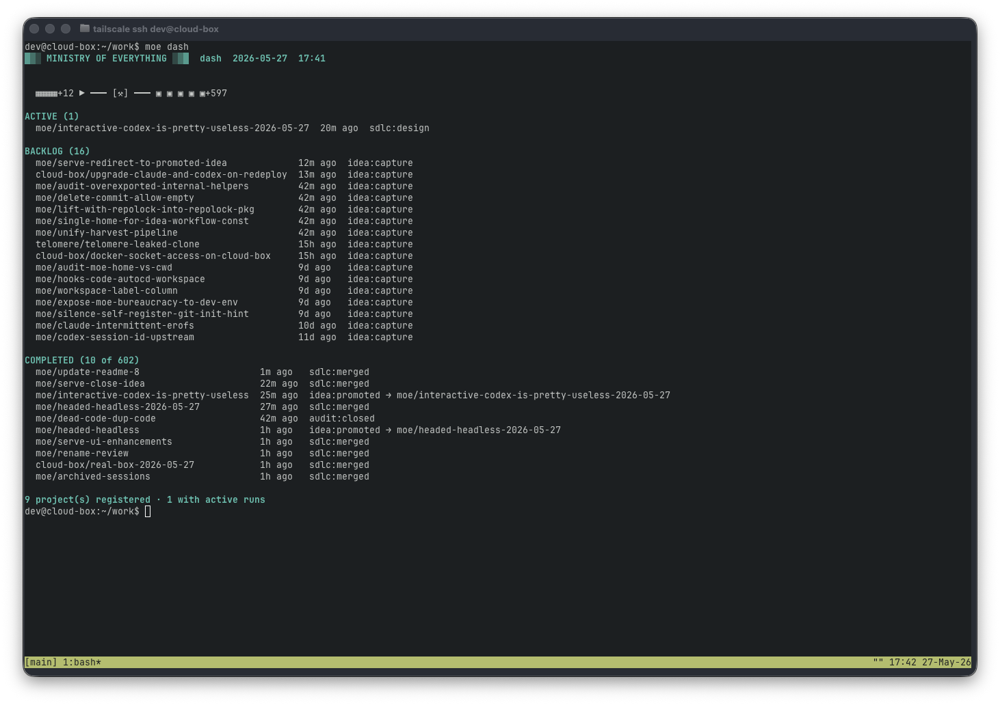
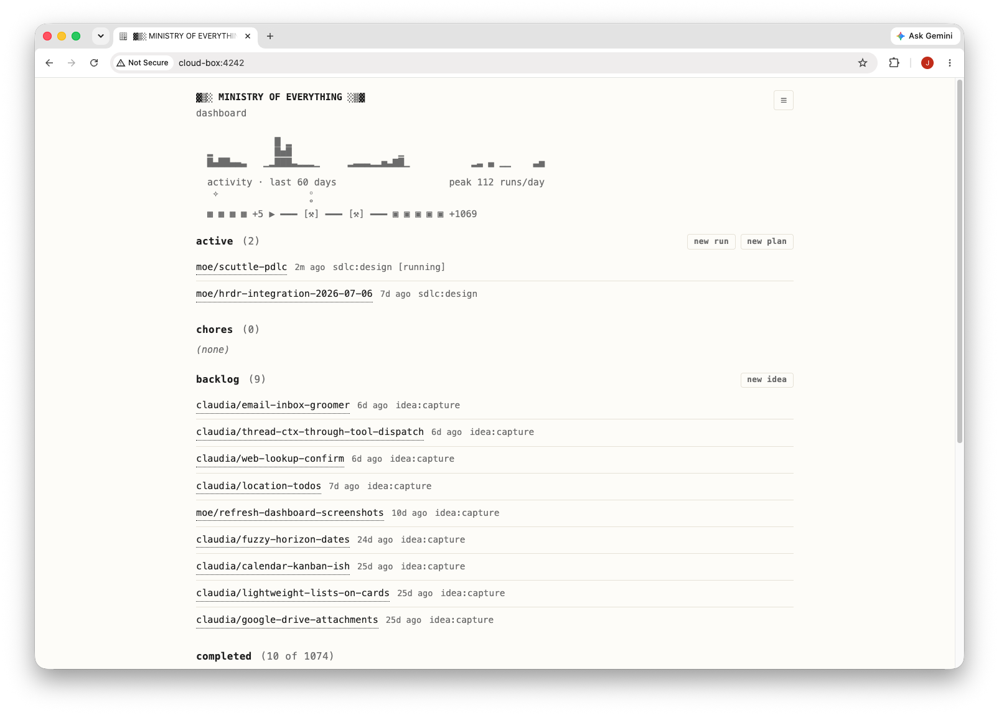

# ▓▒░ MINISTRY OF EVERYTHING ░▒▓

Ministry of Everything (MoE) is a CLI-first harness for one operator directing
AI agents through durable markdown work. It runs
[Claude Code](https://claude.com/claude-code) or
[Codex](https://chatgpt.com/codex/) against living markdown documents.

Running several agent threads usually means chat-history archaeology: the
design lives in one scrollback, the test evidence in another, and the context
dies with the session. MoE's answer is that every stage of work writes a short
canvas — an artifact the next stage reads without replaying the whole chat —
and every turn is committed to a personal Git journal, so the project keeps
memory that can be resumed, reverted, audited, and reused.

There is no daemon, no scheduler, and no swarm. Agents act when you invoke a
command, and the operator stays strategist, reviewer, and source of judgment.
The bet behind that stance: agents have made careful work cheap. When a
designed, reviewed, tested change costs one conversation and two keystrokes,
the discipline that used to be overhead becomes the default path. What MoE
removes is the coordination tax — opening work, handing context forward,
checking progress, filing the lessons that should shape the next run.

Everything works from the CLI:



And there's also a small web server available which is useful for quick checks
from a phone (via something like Tailscale) or for use locally to browse runs
and canvas files, lore, per-project hubs, project knowledge, and twin docs:



## The 60-Second Taste

The everyday path is two commands and one conversation:

```sh
moe idea new my-project/add-batch-support              # jot it when it occurs to you
moe sdlc new --from-idea my-project/add-batch-support  # promote it to a run
```

Promoting the idea offers to jump straight into the design stage: one
conversation that shapes the note into a reviewable plan. When the stage ends,
MoE prints a chain prompt. Type `!!` there, and the run codes, reviews, tests,
and ships itself headlessly — each stage reading the canvas the previous stage
wrote, each turn committed to the journal.

The bangs are the lever for how far a run travels without you: `!` runs just
the next stage and parks at the gate, `!<stage>` runs up to a named gate, `!!`
ships this run, and `!!!` ships it and rides on into the next queued run. The
full vocabulary — every stage spelled out, chains, and the matching CLI flags
— is in [docs/workflows.md](docs/workflows.md#sdlc).

## You Might Want MoE If

- you run several agent threads and need to resume them without chat-history
  archaeology;
- you want agents to work from durable design, test, review, and knowledge
  artifacts instead of one long prompt;
- you want follow-up ideas, project intent, and cross-project lessons to feed
  future runs automatically;
- you want recurring maintenance to surface as ready-to-open runs instead of
  living in your memory;
- you prefer explicit CLI commands and Git history over a hosted coordination
  product.

## Install

Requires Go 1.26+ and at least one agent backend on your `PATH`:
[Claude Code](https://claude.com/claude-code) for `claude`, or Codex for
`codex`.

```sh
go install github.com/modulecollective/moe/cmd/moe@latest
```

Then initialize a bureaucracy — the private Git repo where all runs, canvases,
and project registrations live — and register a project:

```sh
mkdir my-bureaucracy && cd my-bureaucracy
moe init
moe project add <repo-url>
```

The default backend is `claude`. To prefer Codex for new runs, set
`MOE_AGENT=codex` or pass `--agent codex` when opening a run or a stage;
interactive Codex needs a one-time permissions profile described in
[docs/reference.md](docs/reference.md#codex-setup). `moe dash` is the terminal
home screen for re-entry, and `moe serve` is the same dashboard as a local web
UI. `moe help` and per-command usage are the source of truth for the exact
command surface.

## The Workflows

Each workflow is a small ladder of stages; a run is one pass through the
ladder. One line each here — [docs/workflows.md](docs/workflows.md) has the
full treatment.

| Workflow | Stages | Use it for |
| --- | --- | --- |
| [`sdlc`](docs/workflows.md#sdlc) | `design` -> `code` -> `review` -> `test` -> `push` | designed code changes with a ship gate |
| [`chat`](docs/workflows.md#chat) | one `chat` session, resumed across sittings | a read-only thinking partner that reviews the project and grooms the backlog |
| [`kb`](docs/workflows.md#knowledge-base-kb) | `research` -> `summarize` | research a topic with an agent and keep the distilled article |
| [`idea`](docs/workflows.md#ideas) | one `idea` canvas, edited through verbs | backlog capture before a full run exists |
| [`twin`](docs/workflows.md#twin) | `vision` -> ... -> `glossary` -> `finalize` | recorded project intent |
| [`hooks`](docs/workflows.md#hooks) | `code` | project-specific hook scripts |
| [`chores`](docs/workflows.md#chores) | `code` | recurring maintenance that surfaces as ready-to-open runs |

## Going Deeper

- [docs/workflows.md](docs/workflows.md) — how to drive each workflow:
  commands, stages, cascades, and chains.
- [docs/concepts.md](docs/concepts.md) — the moving parts: runs and canvases,
  the bureaucracy repo, sandboxes and workspaces, feedback channels, and how
  agents are steered.
- [docs/reference.md](docs/reference.md) — the command catalog, Codex setup,
  shell completion, hooks/dev-env/secrets, and cleanup and recovery.

## Status

MoE is pre-1.0 and under active development. The command surface, file layout,
and trailer conventions can change. Expect sharp edges.

## Contributing

Don't :-) Not accepting issues or PRs right now. This is one firm's internal
tool, shared in case it is useful.

## License

MIT. See [`LICENSE`](LICENSE).

## References

- [Module Collective: Building a Ministry of Everything](https://www.modulecollective.com/posts/building-a-ministry-of-everything/)
- [Module Collective: Reflecting on the first 750 runs of the Ministry of Everything](https://www.modulecollective.com/posts/reflecting-on-750-runs-of-moe/)
- [Anthropic: Effective Harnesses for Long-Running Agents](https://www.anthropic.com/engineering/effective-harnesses-for-long-running-agents)
- [Martin Fowler: Harness Engineering](https://martinfowler.com/articles/exploring-gen-ai/harness-engineering.html)
- [Chad Fowler: The Phoenix Architecture](https://aicoding.leaflet.pub/)
- [Karpathy: LLM Wiki gist](https://gist.github.com/karpathy/442a6bf555914893e9891c11519de94f)
