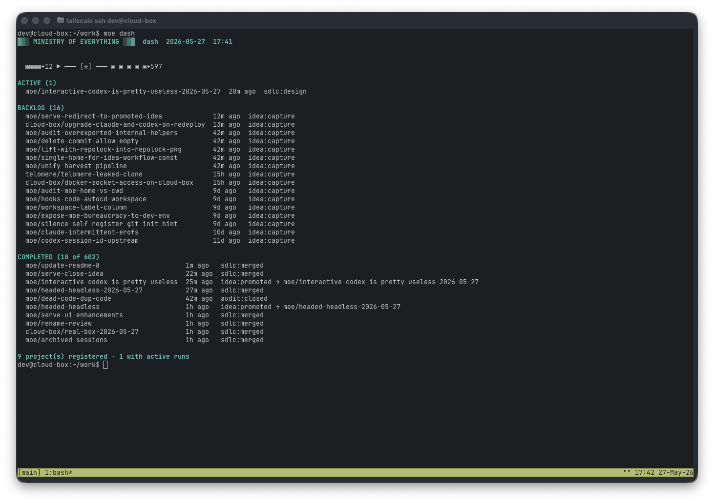
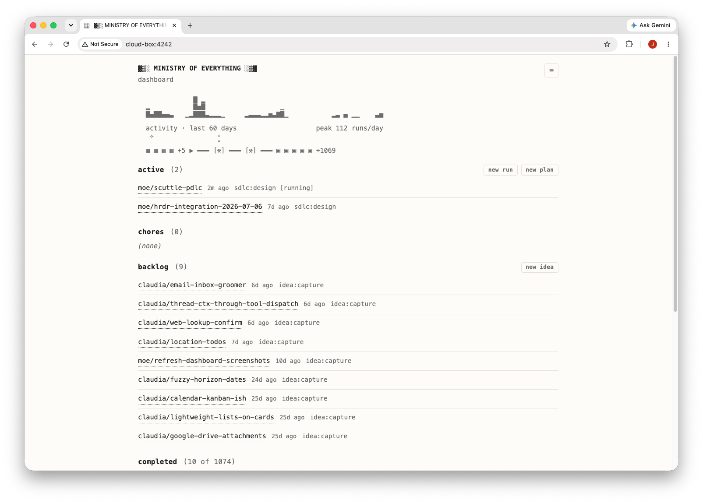

# ▓▒░ MINISTRY OF EVERYTHING ░▒▓

Ministry of Everything (MoE) is a CLI-first harness for one operator and the
AI agents working for them. It runs
[Claude Code](https://claude.com/claude-code) or
[Codex](https://chatgpt.com/codex/) against living markdown documents — durable
context that outlasts the sessions that write it.

Running several agent threads usually means chat-history archaeology: the
design lives in one scrollback, the test evidence in another, and the context
dies with the session. MoE's answer is that every stage of work writes a short
canvas — an artifact the next stage reads without replaying the whole chat —
and every turn is committed to a personal Git journal, so the project keeps
memory that can be resumed, reverted, audited, and reused.

Work travels as far as you license, and no further. Typed, that's a bang
grammar: `!` runs one stage and parks at the gate, `!!!` ships the run and rides
the chain queued behind it. Standing, it's an armed `moe serve --dynamic`,
whose heartbeat surveys each project's board, opens work that's ready — a due
chore, a tagged idea, a parked chain — and rides it through test, review, and
ship while you're away. Stopping that process retracts all of it.

Underneath is a bet that agents have made careful work cheap. When a designed,
reviewed, tested change costs one conversation and two keystrokes, the
discipline that used to be overhead becomes the default path. What still costs
is coordination — opening work, handing context forward, checking progress,
filing the lessons that should shape the next run — so coordination is what MoE
automates.

MoE is deliberately single-operator: one person's backlog, one person's
journal, no accounts and no sharing. [Anti-Social on
Purpose](#anti-social-on-purpose) has the reasoning.

MoE is built with MoE — every change ships through the same workflows it
provides, and these days most of those runs open themselves.

Everything works from the CLI:



And there's also a small web server available which is useful for quick checks
from a phone (via something like Tailscale) or for use locally to browse runs
and canvas files, lore, per-project hubs, project knowledge, and twin docs:



## The 60-Second Taste

The everyday path is two commands and one conversation:

```sh
moe idea new my-project/add-batch-support              # jot it when it occurs to you
moe sdlc new --from-idea my-project/add-batch-support  # promote it to a run
```

Promoting the idea offers to jump straight into the design stage: one
conversation that shapes the note into a reviewable plan. When the stage ends,
MoE prints a chain prompt. Type `!!` there, and the run codes, reviews, tests,
and ships itself headlessly — each stage reading the canvas the previous stage
wrote, each turn committed to the journal.

The bangs are the lever for how far a run travels without you: `!` runs just
the next stage and parks at the gate, `!<stage>` runs up to a named gate, `!!`
ships this run, and `!!!` ships it and rides on into the next queued run. The
full vocabulary — every stage spelled out, chains, and the matching CLI flags —
is in [docs/workflows.md](docs/workflows.md#sdlc).

`!!!` is where the economics turn: shape a few runs during the day,
`moe chain edit` them into a sequence, and fire `!!!` once as you step away.
The chain then codes, reviews, tests, and ships on capacity your flat-rate dev
subscription already pays for while you sleep — each run still gated,
journaled, and revertible in the morning.

The standing rung removes even that keystroke. Leave `moe serve --dynamic`
running and its heartbeat finds ready work across each project's board, opens
it, and carries it through the same gates and journal, no `!!!` required.
Stopping the process is the off switch. When a run needs your judgment, push it
a sentence — `moe input add` from the terminal, or the web's `/input` queue
from a phone — and the next turn on that run acts on it. A sweep can ask you
something the same way, and you answer it in prose.

## You Might Want MoE If

- you run several agent threads and need to resume them without chat-history
  archaeology;
- you want agents to work from durable design, test, review, and knowledge
  artifacts instead of one long prompt;
- you want follow-up ideas, project intent, and cross-project lessons to feed
  future runs automatically;
- you want to steer by intent and monitor by exception — writing direction and
  reviewing what merges, while most runs open themselves;
- you want recurring maintenance to surface as ready-to-open runs instead of
  living in your memory — and, once you arm `moe serve --dynamic`, to open and
  ride itself;
- you pay for a flat-rate dev subscription that idles sixteen hours a day and
  would rather it worked a queue overnight than sat unused;
- you prefer explicit CLI commands and Git history over a hosted coordination
  product.

## Anti-Social on Purpose

MoE is deliberately single-operator. There are no accounts, no sharing, and no
multi-operator coordination surface — that is a recorded non-goal, not a
feature that hasn't been built yet.

The reason is what total capture buys. MoE saves *everything*: every
conversation, every turn, every canvas, committed to a private journal. That
total record is what makes work resumable, auditable, and reusable — and it is
only comfortable because the journal is yours alone. Do the same across a team
and you inherit consent, privacy, and signal-to-noise problems that reshape the
whole system: who reads whose transcripts, what gets redacted before capture,
whose judgment a shared twin encodes.

So MoE is social in exactly one direction: between one operator and their
agents. That relationship is what accumulates — canvases, twin, lore, and
backlog are its shared memory — and the harness's whole job is to make that one
relationship compound rather than to coordinate many.

## Install

Requires Go 1.26+ and at least one agent backend on your `PATH`:
[Claude Code](https://claude.com/claude-code) for `claude`, or Codex for
`codex`.

```sh
go install github.com/modulecollective/moe/cmd/moe@latest
```

Then initialize a bureaucracy — the private Git repo where all runs, canvases,
and project registrations live — and register a project:

```sh
mkdir my-bureaucracy && cd my-bureaucracy
moe init
moe project add <repo-url>
```

The default backend is `claude`. To use Codex, pass `--agent codex` when
opening a run or a stage, set `MOE_FORCE_AGENT=codex` for every turn in one
process, or select it with a model-stylesheet `agent:` rule. Codex needs no
permissions-profile setup because MoE supplies it.
See [docs/reference.md](docs/reference.md#codex-setup) for the sandbox details.
`moe dash` is the terminal
home screen for re-entry, and `moe serve` is the same dashboard as a local web
UI. `moe help` and per-command usage are the source of truth for the exact
command surface.

## The Workflows

Each workflow is a small ladder of stages; a run is one pass through the
ladder. One line each here — [docs/workflows.md](docs/workflows.md) has the
full treatment.

| Workflow | Stages | Use it for |
| --- | --- | --- |
| [`sdlc`](docs/workflows.md#sdlc) | `design` -> `code` -> `test` -> `review` -> `push` | designed code changes with a ship gate |
| [`chat`](docs/workflows.md#chat) | one `chat` session, resumed across sittings | a read-only thinking partner that reviews the project and grooms the backlog |
| [`idea`](docs/workflows.md#ideas) | one `idea` canvas, edited through verbs | backlog capture before a full run exists |
| [`intent`](docs/workflows.md#intents) | one `intent` canvas, edited through verbs | operator-authored standing direction agents read but never originate |
| [`pulse`](docs/workflows.md#pulse) | `pulse` | a read-only survey, fired by the armed serve's heartbeat or by hand, that feeds the backlog, grooms queued work into lanes, and under `--dynamic` starts what's ready |
| [`chain`](docs/workflows.md#chains) | one `chain` purpose note, no stages | a placeholder head: the batch chained behind it rides as one on `moe chain kick` |

Three bureaucracy-side artifacts have no workflow of their own — project
[hooks](docs/workflows.md#hooks), [chores](docs/workflows.md#chores), and
[knowledge topics](docs/workflows.md#knowledge). Edit them by hand, or let an
sdlc run land them: a stage's per-turn commit picks all three up. Such a run
ships nothing to the target repo — its test gate says so (`ship: none`) and
`push` closes it.

## Going Deeper

- [docs/workflows.md](docs/workflows.md) — how to drive each workflow:
  commands, stages, cascades, and chains.
- [docs/concepts.md](docs/concepts.md) — the moving parts: runs and canvases,
  the bureaucracy repo, sandboxes and workspaces, feedback channels, and how
  agents are steered.
- [docs/reference.md](docs/reference.md) — the command catalog, Codex setup,
  shell completion, hooks/dev-env/secrets, and cleanup and recovery.
- [docs/evolution.md](docs/evolution.md) — how MoE moved from supervised
  sessions to work that finds, orders, and starts itself.
- [docs/un-changelist.md](docs/un-changelist.md) — what removed experiments
  taught MoE about services, workflows, queues, memory, and trust.

## Status

MoE is pre-1.0 and under active development. The command surface, file layout,
and trailer conventions can change. Expect sharp edges.

## Contributing

Please don't contribute :-) Not accepting issues or PRs right now. This is one firm's internal
tool, shared in case it is useful.

## License

MIT. See [`LICENSE`](LICENSE).

## References

- [Module Collective: Building a Ministry of Everything](https://www.modulecollective.com/posts/building-a-ministry-of-everything/)
- [Module Collective: Reflecting on the first 750 runs of the Ministry of Everything](https://www.modulecollective.com/posts/reflecting-on-750-runs-of-moe/)
- [Boris Cherny: Steps of AI Adoption](https://claude.ai/code/artifact/bfdfaef9-bc62-4dfe-ba9e-c58a26c9accf)
- [Salvatore Sanfilippo: Control the ideas, not the code](https://antirez.com/news/169)
- [Anthropic: Effective Harnesses for Long-Running Agents](https://www.anthropic.com/engineering/effective-harnesses-for-long-running-agents)
- [Martin Fowler: Harness Engineering](https://martinfowler.com/articles/exploring-gen-ai/harness-engineering.html)
- [Chad Fowler: The Phoenix Architecture](https://aicoding.leaflet.pub/)
- [Andrej Karpathy: LLM Wiki gist](https://gist.github.com/karpathy/442a6bf555914893e9891c11519de94f)
- [Alasdair Monk: Quality Software](https://x.com/almonk/status/2079461952577802549)
